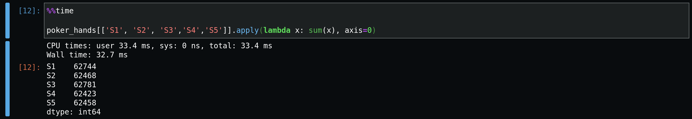
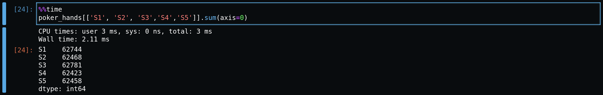
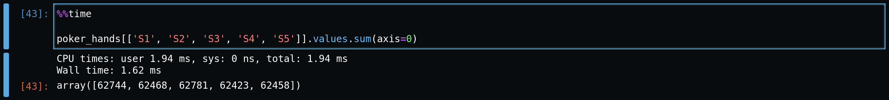

# Vectorizing DataFrames with NumPy Arrays

Here's a quick trick to speed up processing time, when performing analysis on a Pandas `DataFrame`. Let's say we want to get the sum of all the values in specific rows or columns. There are several ways to approach this task. 

We'll consider a few approaches: one horrible, and a few decent. And to conclude, we'll find there's an even more optimal way, that uses NumPy highly optimized C source code. But first, let's consider our worst possible option. 

**Note**: we're using some Jupyter cell magic, `%%time` to time our function calls. This function measures runtime on a given cell. These times vary, but in general, we can use these times as a baseline measurement for performance. Time is measured in seconds, milliseconds, or microseconds.

## The Dreaded `for` loop

The naive approach is to loop over the entire `DataFrame`, using `for` or `while`. Let's see how this performs.

Again, this a relatively small dataset, so 3 seconds here will mean a slow down on larger sets. Such an approach can be costly and doesn't take utilize panda's optimized built in methods, which have the added benefit of being easier to conceptualize and code. This efficiency is critical when working with massive datasets. 

## `df.apply()`

Now for our next best solution, although far from optimal. Let's get familiar with `df.apply()`. The beauty of `apply()` is its flexibility. You can pass any NumPy operation, such as `np.sqrt()`, to perform calculations over the `DataFrame`.

Even more impressive, you can write custom functions and pass them to `apply()` for context specific operations, such as calculating conversion rates or other Key Performance Indicators (KPIs). Let's see how this performs for our simple task. Here we sum over rows.

To specify whether the calculation is performed over columns or rows, you pass the argument `axis=0`, for rows, and `axis=1`, for columns. 

## df.sum()

Now, we'll start using a more optimized approach, `df.sum()`. Here we get a better runtime. The cost however, is we don't get the flexibility of `apply()` to pass custom or NP functions.

Again we specify the axis to sum over rows. Incredibly, we see a huge jump in performance by using `sum`. But can we go further?

## Vectorization with NumPy Arrays using `df.values`

Now for the moment we've all been waiting for, our champion, `.values`

NumPy, under the hood, uses optimized C code. When we call a NumPy function, we're actually accessing the Python binding of a C library. This neat feature is what has really enabled state of the art data analysis and data science in Python. Python, the language, was consciously designed to favor code that's more beautiful for the developer than the computer. Due to the C bindings, we get the best of both code 'readability' and performance! Specifically, the C library is performing a powerful method of computation over large numbers of arrays, called vectorization.

But notice, we're talking about NumPy arrays here, not Pandas DataFrames. Pandas uses a native Python coded `series` object for its operations; NumPy uses `ndarray`. These `ndarray` objects leave out a lot of 'nice to haves' found in `pd.series`. These include data-type checking, indexing, and other potentially expensive features. Without these, `ndarrays` are many times faster and can be quite useful, when the additional functionality is not necessary.

Let's see how to work with a `DataFrame` as an `ndarray`. 

It's as simple as specifying `df.values`, which is an attribute of the `DataFrame`. Well, technically it's a property, which you can think of as an attribute you can't (or shouldn't) modify externally as a developer. You specify `.values` and then and call a method over it. Alternatively, you can call `df.to_numpy` for similar functionality. And a word of caution, if your column or row contains a mix of both `ints` and `floats`, one type will be determined to capture all of the types. `Floats` being a lot more memory intensive could lead to a possible issue you didn't foresee, so plan your `dtypes` accordingly. 

And there we have it! Compared to where we started with the `for` loop and even `apply`, we've seen dramatic improvements, of orders of magnitude. When running these operations on massive datasets, we can expect even larger differences in performance.

I hope this article helped you see how Pandas offers the blessing of a variety of ways to solve a task. With a little insight into how Pandas functions under the hood, you can find the approach that cuts down on precious computation time and resources. Now go on and write smarter and faster Python code!